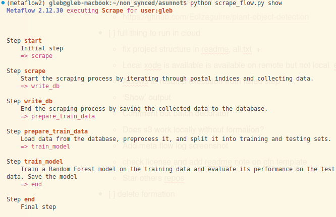

# Real Estate Price Prediction in Finland

This project aims to predict property prices in Finland.
It scrapes data on Finnish real estate transactions from the last 12 months [available here](https://asuntojen.hintatiedot.fi/haku).
The data for the 10 major cities (and nearby postal indices; 10-20K entries) is used to train a regression model.
The model can then be used to evaluate the price of a given apartment or house - I got RMSE of 500 €/m2 with it (and a similar result by training a black box model in `AWS SageMaker`)


## Project Structure

```
├── aws
│   └── metaflow-cfn-template.yml
├── asunnot
│   ├── db.py
│   └── init.py
├── eval.py
├── scrape_flow.py
├── train_flow.py
├── requirements.txt
└── postinumerot
    ├── all.txt
    └── test.txt
```


## Installation
Activate a virtual environment of your choice (using e.g. `venv`, `poetry` or `conda`).
Then install `metaflow` and other dependencies using
```bash
pip install -r requirements.txt
```

## Usage
The model is trained on the cloud using `metaflow` as orchestrator. To provision resources use the template from `aws` folder in `AWS CloudFormation`. After the stack is deployed, run
```bash
metaflow configure
```
filling all the variables - as explained in [metaflow tutorial](https://docs.metaflow.org/getting-started/tutorials/season-2-scaling-out-and-up/episode05).
After that you may want to do
```bash
export METAFLOW_DEFAULT_METADATA=local
```
as well as add api-key `"METAFLOW_SERVICE_HEADERS": {"x-api-key": "your_key_value"}` into `metaflow`'s `config.json` - see here for
[explanation of how to obtain your_key_value](https://docs.outerbounds.com/engineering/deployment/aws-managed/cloudformation/).


### Flow structure and outputs


The flow above will use `s3` to store the data
```
... Database saved at s3://metaflow-metaflows3bucket-pjf8fxduvau5/data/Scrape/1731836622442140/database
```
as well as the model artifact:
```
...Model saved to s3://metaflow-metaflows3bucket-pjf8fxduvau5/data/Scrape/1731836622442140/trained_model...
...RMSE: 394.61138501081615
```


### Using the flow to train a model
To train a model on real estate data, run the `scrape_flow.py` script. This will collect data from the specified URLs and store it in a SQLite database.
Then it will load the data from the database, preprocess it, and train a Random Forest model.
```bash
python scrape_flow.py run
```
To run locally comment out the `@batch` decorators and all `S3` mentions.

### Inference using the trained model
To predict the price for property of your choice, use the `inference.py` script. This script loads the model artifact (local) and makes predictions based on the input data.
```bash
python inference.py
```
