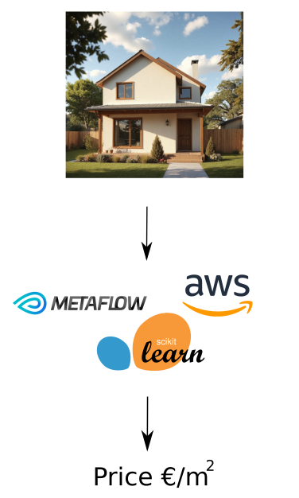

# Real Estate Price Prediction in Finland

This project aims to predict property prices in Finland.
It scrapes data on Finnish real estate transactions from the last 12 months [available here](https://asuntojen.hintatiedot.fi/haku).
The data for the 10 major cities (and nearby postal indices) is used to train a regression model.
The model can then be used to evaluate the price of a given apartment or house - I got RMSE of 500 €/m2 with it (and a similar result by training a black box model in `AWS SageMaker`)



## Project Structure

```
├── aws
│   └── metaflow-cfn-template.yml
├── asunnot
│   ├── db.py
│   └── init.py
├── eval.py
├── scrape_flow.py
├── train_flow.py
├── requirements.txt
└── postinumerot
│   ├── all.txt
│   └── test.txt
```

## Installation
Activate a virtual environment of your choice (using e.g. `venv`, `poetry` or `conda`).
Then install `metaflow` and other dependencies using
```bash
pip install -r requirements.txt
```

## Usage

### Scraping Data
To scrape real estate data, run the `scrape_flow.py` script. This will collect data from the specified URLs and store it in a SQLite database.
```bash
python scrape_flow.py run
```

### Training the Model
To train the model, execute the `train_flow.py` script. This will load the data from the database, preprocess it, and train a Random Forest model.
```bash
python train_flow.py run
```

### Inference
To predict the price for property of your choice, use the `eval.py` script. This script loads the model and makes predictions based on the input data.
```bash
python eval.py
```
